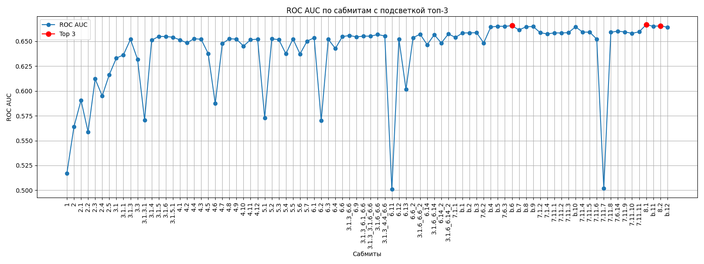

# 📂 B.Processing - Обработка данных и эксперименты

🚀 Здесь находятся все  ноутбуки, использованные для обучения моделей на протяжении всего хакатона. В этой папке собраны как тренировочные, так и тестовые ноутбуки, которые охватывают весь процесс, от предобработки до финальных экспериментов.

##  Структура папки

Папка **B.Processing** включает в себя следующие ноутбуки:

- **train** — Ноутбуки для обучения моделей.
- **test** — Ноутбуки для тестирования и оценки моделей.

## 📊 Результаты

Все результаты экспериментов представлены в виде метрики **ROC AUC**, и они находятся в файле **`roc_auc_plot.png`**. Это график, который отображает результаты всех проведённых экспериментов с подсветкой топ-3 лучших моделей. 🎯

